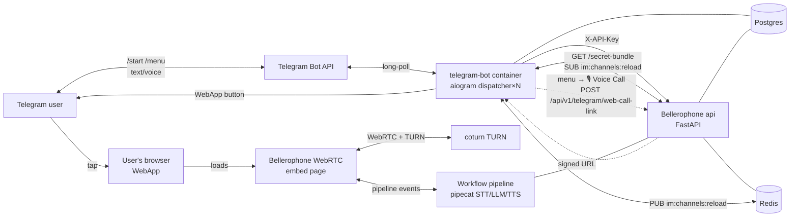
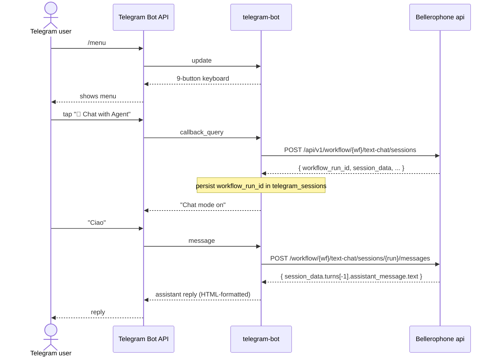
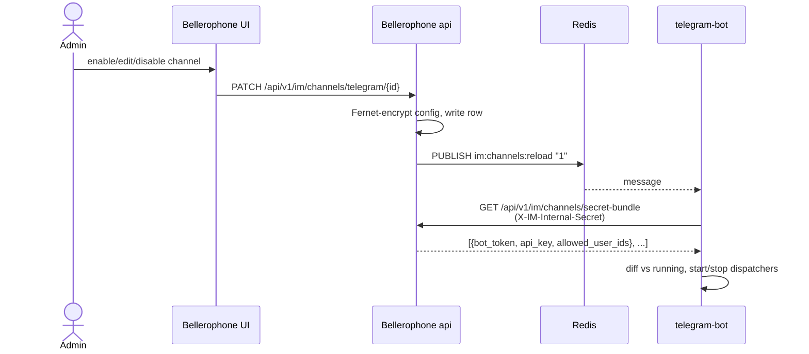

## Component map



## Outbound text-chat sequence



## Voice-call sequence (real-time, WebApp link path)

```mermaid
sequenceDiagram
    actor U as Telegram user
    participant TG as Telegram Bot API
    participant B as telegram-bot
    participant A as Bellerophone api
    participant Br as Browser (WebApp)
    participant Co as coturn / WebRTC

    U->>TG: tap "🎙️ Voice Call"
    TG->>B: callback_query
    B->>A: POST /api/v1/telegram/web-call-link {workflow_id, chat_id}
    Note over A: create SmallWebRTC workflow_run<br/>Fernet-sign token (5 min TTL)
    A-->>B: { url: https://host/api/v1/telegram/web-call/<token> }
    B-->>TG: WebApp button
    U->>TG: tap WebApp button
    TG->>Br: open URL
    Br->>A: GET /telegram/web-call/<token>
    A-->>Br: embed page bootstrap
    Br<-->Co: WebRTC + TURN
    Br<-->A: pipeline events (STT/LLM/TTS)
```

## Hot-reload of bot tokens



## Where each component lives

| Component | Path |
|---|---|
| Bot container | `telegram-bot/` |
| Bot menu + handlers | `telegram-bot/bot/menu.py`, `telegram-bot/bot/handlers.py` |
| Bot multi-channel loader | `telegram-bot/bot/channels.py` |
| IM channels backend router | `api/routes/im_channels.py` |
| IM channels service (encrypt + Redis pub) | `api/services/im/channel_service.py` |
| Web-call link signer | `api/services/im/web_call_link.py` |
| Telegram-specific api routes | `api/routes/telegram.py` |
| IM channels UI page | `ui/src/app/channels/im/page.tsx` |
| Sidebar entry | `ui/src/components/layout/AppSidebar.tsx` (`IM Channels`) |
| DB models | `api/db/models.py` → `ImChannelModel` |
| Alembic migrations | `api/alembic/versions/a4b5c6d7e8f9_telegram_im_tables.py`, `b5c6d7e8f9a0_im_channels.py` |
| Architecture decisions | `docs/adr/ADR-100..103` |
