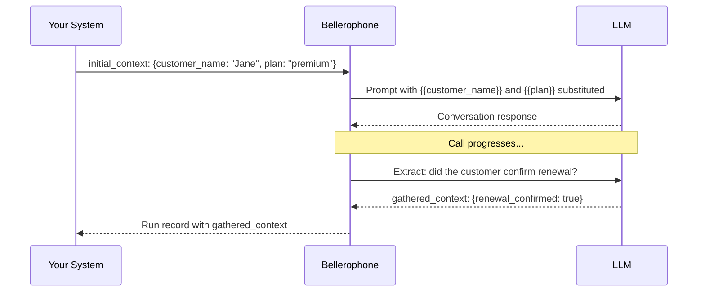

Bellerophone has a simple data model for passing information through a call. Understanding it is key to building agents that feel personalised and to extracting useful results after a call.

## The three context objects

```
initial_context ──► Agent ──► gathered_context
                       │
                 [template variables](/voice-agent/template-variables)
                 (used in prompts)
```

### initial_context

Data available to the agent before the call starts — the contact's name, account details, appointment information, anything the agent should know upfront. It can be set from several places:

- **API trigger** — pass it in the request body when calling `POST /public/agent/{uuid}` or `POST /telephony/initiate-call`
- **Campaign CSV** — columns beyond `phone_number` automatically become `initial_context` fields for each contact's call
- **Dashboard** — set default template context variables on the agent, used when no external context is provided

```json
{
  "phone_number": "+14155550100",
  "initial_context": {
    "customer_name": "Jane Smith",
    "plan": "premium",
    "renewal_date": "April 1"
  }
}
```

### Template variables

Values from `initial_context` are available in your agent's prompt using `{{double_brace}}` syntax.

```
You are calling {{customer_name}} about their {{plan}} plan,
which renews on {{renewal_date}}. Be friendly and confirm
whether they'd like to continue.
```

When the call starts, Bellerophone substitutes the values before sending the prompt to the LLM — so the agent speaks naturally as if it already knows the contact.

### Fallback values

If a variable might be missing or empty, use a pipe (`|`) to provide a default value:

```
Hello {{customer_name | there}}, we're calling about your {{plan | current}} plan.
```

When `customer_name` is not set, the agent will say "Hello there" instead of leaving a blank. The syntax is:

```
{{variable_name | fallback_value}}
```

If the variable is present and non-empty, the fallback is ignored and the actual value is used.

### Default variables

Built-in variables for current time and weekday, available in any prompt without setting up `initial_context`.

| Variable | Description | Example output |
|---|---|---|
| `{{current_time}}` | Current time in UTC (or inferred timezone) | `2026-04-02 14:30:45 UTC` |
| `{{current_time_<TIMEZONE>}}` | Current time in the specified timezone | `2026-04-02 20:00:45 IST` |
| `{{current_weekday}}` | Current weekday name in UTC (or inferred timezone) | `Thursday` |
| `{{current_weekday_<TIMEZONE>}}` | Current weekday name in the specified timezone | `Thursday` |

Replace `<TIMEZONE>` with an [IANA timezone name](https://en.wikipedia.org/wiki/List_of_tz_database_time_zones) such as `Asia/Kolkata`, `America/New_York`, or `Europe/London`.

```
Today is {{current_weekday}} and the current time is {{current_time_America/New_York}}.
```

<Note>
When you use a timezone suffix on **either** `current_time` or `current_weekday`, the other variable without a suffix will automatically use the same timezone instead of UTC. For example, if your prompt contains both `{{current_time_Asia/Kolkata}}` and `{{current_weekday}}`, the weekday will also be resolved in `Asia/Kolkata`.
</Note>

### Telephony variables

For telephony calls (inbound and outbound), Bellerophone automatically adds these variables to `initial_context`:

| Variable | Description | Example |
|---|---|---|
| `{{caller_number}}` | The phone number that initiated the call | `+14155550100` |
| `{{called_number}}` | The phone number that received the call | `+18005550199` |

For **inbound** calls, `caller_number` is the customer's number and `called_number` is your Bellerophone number. For **outbound** calls, it's the reverse — `caller_number` is your Bellerophone number and `called_number` is the customer's number.

```
You are speaking with the caller at {{caller_number}}.
```

### gathered_context

Data the agent collects *during* the call. You configure what to extract in the agent node's extraction settings — each variable has a name, type, and a prompt that tells the LLM what to look for.


`gathered_context` is returned in the run record after the call completes and is available in [webhook payloads](/developer/webhooks) for downstream processing.

## Data flow example



## Where variables are available

| Location | Variables available |
|---|---|
| Agent node prompts | `initial_context` fields via `{{variable_name}}` |
| Edge conditions | Evaluated against the live conversation — no explicit variable syntax needed |
| Webhook payload templates | All context objects via `{{initial_context.field}}`, `{{gathered_context.field}}` etc. |
| Campaign CSV columns | CSV columns beyond `phone_number` become `initial_context` fields automatically |
